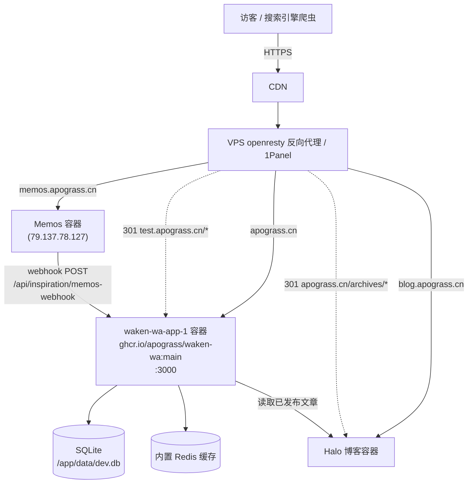

# Design Document: Site Launch Migration (正式上线域名迁移 + Sitemap)

## Overview

把 waken-wa 个人主页从 `test.apograss.cn` 正式迁移到主域名 `apograss.cn`，同时把原来占用 `apograss.cn` 的 Halo 博客迁到 `blog.apograss.cn`，并为主页新增 `sitemap.xml` / `robots.txt` 以支持搜索引擎收录。DNS 与 CDN 已配置完成，本次工作聚焦于**应用层代码改动**（规范域名输出、博客链接指向、sitemap/robots 生成）和**反向代理 / CDN 层的切换与 301 重定向 runbook**。

迁移分为两条相互独立的工作流：
1. **代码改动**（可提前合并、镜像构建、随时部署）：sitemap、robots、canonical 基础 URL、`HALO_BASE_URL` 指向新博客域名、Memos webhook URL 迁移。
2. **上线切换 runbook**（需要在维护窗口按顺序执行）：环境变量更新 → 镜像部署 → 反代/CDN 域名与 301 切换 → Memos webhook 重指向 → 验证 → 回滚预案。

本设计同时包含高层架构（图 + 组件 + 数据流 + 切换 runbook）与低层实现（具体文件、函数签名、伪/真实代码）。

---

# Part 1 — High-Level Design

## Architecture

### 目标拓扑（切换后）



### 域名职责矩阵

| 域名 | 切换前 | 切换后 | 负责服务 |
|------|--------|--------|----------|
| `apograss.cn` | Halo 博客 | waken-wa 主页（canonical） | waken-wa-app-1 |
| `blog.apograss.cn` | （不存在） | Halo 博客 | Halo 容器 |
| `test.apograss.cn` | waken-wa 主页 | 301 → `apograss.cn` | 反代重定向 |
| `memos.apograss.cn` | Memos | Memos（不变） | Memos 容器 |
| `apograss.cn/archives/*` | Halo 文章 | 301 → `blog.apograss.cn/archives/*` | 反代重定向（保 SEO） |

## Components and Interfaces

### 组件 1：Canonical Base URL 解析器（新增）

**Purpose**：为 sitemap、robots、（可选）OG/canonical metadata 提供唯一权威的站点基础 URL，杜绝运行时输出中出现硬编码的 `test.apograss.cn`。

**Interface**：
```typescript
// lib/site-url.ts
/** 返回规范站点根 URL，无尾部斜杠。优先级：SITE_URL env > 默认 https://apograss.cn */
export function getSiteBaseUrl(): string
/** 在 base 上拼接路径，保证单斜杠。 */
export function absoluteUrl(path: string): string
```

**Responsibilities**：
- 从 `process.env.SITE_URL`（或 `NEXT_PUBLIC_SITE_URL`）读取，缺省回落到 `https://apograss.cn`。
- 规整尾部斜杠（与 `halo-blog.ts` 中 `.replace(/\/+$/, '')` 同款处理）。
- 供 `app/sitemap.ts`、`app/robots.ts` 以及 `app/layout.tsx` 的 `metadataBase` 使用。

### 组件 2：Sitemap 生成器（新增 `app/sitemap.ts`）

**Purpose**：输出 `/sitemap.xml`，包含静态路由与动态灵感条目。

**Interface**（Next.js App Router 约定）：
```typescript
// app/sitemap.ts
export default async function sitemap(): Promise<MetadataRoute.Sitemap>
```

**Responsibilities**：
- 列出静态路由：`/`（home）、`/inspiration`（archive list）。
- 从 DB 枚举所有灵感条目，生成 `/inspiration/{id}` 动态条目，`lastModified` 取 `updatedAt ?? createdAt`。
- 当 `searchEngineIndexingEnabled === false` 时返回空数组（不暴露任何 URL）。
- DB 不可用时静默回落到仅静态路由（不让构建/请求失败）。

### 组件 3：Robots 生成器（新增 `app/robots.ts`，可选但推荐）

**Purpose**：输出 `/robots.txt`，引用 sitemap 并尊重 `searchEngineIndexingEnabled`。

**Interface**：
```typescript
// app/robots.ts
export default async function robots(): Promise<MetadataRoute.Robots>
```

**Responsibilities**：
- 索引开启：`allow: '/'` + `sitemap: absoluteUrl('/sitemap.xml')`。
- 索引关闭：`disallow: '/'`（与 `layout.tsx` 现有 `<meta robots noindex>` 行为一致）。

### 组件 4：Halo 博客链接（修改 `lib/halo-blog.ts` — 仅 env 改动，无代码变更）

**Purpose**：主页"灵感/博客"条与页脚"去博客逛逛"链接在切换后指向 `blog.apograss.cn`。

**Interface（保持不变）**：`haloBlogHomeUrl()`、`fetchRecentHaloBlogPosts(limit)`。

**Responsibilities**：通过设置 `HALO_BASE_URL=https://blog.apograss.cn` 环境变量改变行为；代码已经是 env 驱动，**无需改源码**。

### 组件 5：Memos Webhook（运维侧 + 脚本默认值）

**Purpose**：切换后 Memos 仍能把新 memo 推送到主页。

**Responsibilities**：
- Memos 服务端 webhook 目标从 `https://test.apograss.cn/api/inspiration/memos-webhook` 改为 `https://apograss.cn/api/inspiration/memos-webhook`（运维操作）。
- `scripts/backfill-memos-inspiration.mjs` 的 `DEFAULT_WAKEN_WEBHOOK_URL` 默认值更新为主域名（仍可被 `WAKEN_MEMOS_WEBHOOK_URL` env 覆盖）。

## Data Models

### Inspiration 条目（既有表，无 schema 变更）

```typescript
// drizzle/schema.sqlite.ts — inspiration_entries（现状）
{
  id: integer (PK, autoincrement),
  title: text | null,
  content: text (not null),
  createdAt: timestamp,
  updatedAt: timestamp,
  // externalSource / externalId / imageDataUrl / contentLexical / statusSnapshot ...
}
```

**收录规则说明**：该表中的条目全部来自 Memos webhook，且 webhook 只同步 `visibility == PUBLIC && state == NORMAL` 的 memo（见 `backfill-memos-inspiration.mjs` 的 `shouldSyncMemo`），因此**表内所有条目均为已公开内容**，sitemap 可全量列出，无需额外 published 过滤字段。主页与 `/inspiration` 归档页也是直接展示这些条目，行为一致。

### Sitemap 条目模型（运行时构造，非持久化）

```typescript
type SitemapEntry = {
  url: string            // absoluteUrl('/inspiration/123')
  lastModified: Date     // updatedAt ?? createdAt
  changeFrequency?: 'daily' | 'weekly' | 'monthly'
  priority?: number      // home=1.0, /inspiration=0.8, entry=0.6
}
```

## Error Handling

| 场景 | 条件 | 响应 | 恢复 |
|------|------|------|------|
| DB 不可用（构建期 / 首启） | sitemap 查询抛错 | 捕获后仅返回静态路由 `/`、`/inspiration` | DB 就绪后下次请求自动包含动态条目 |
| 索引被关闭 | `searchEngineIndexingEnabled === false` | sitemap 返回 `[]`，robots `disallow: '/'` | 后台开启开关后恢复 |
| `SITE_URL` 未设置 | env 缺失 | 回落 `https://apograss.cn` | 显式设置 env 即可覆盖 |
| Halo 拉取失败 | `blog.apograss.cn` 暂不可达 | `fetchRecentHaloBlogPosts` 已 try/catch 返回 `[]`，主页照常渲染 | 博客恢复后自动恢复（含 600s revalidate） |
| Memos webhook 旧地址仍被调用 | 切换期间未及时改 Memos 配置 | 反代对 `test.apograss.cn/*` 做 301 到 `apograss.cn`，POST 在 301 下可能丢失 body | runbook 中明确"改 Memos 目标"为切换步骤，并保留 test→主域 301 兜底 |

## Launch / Cutover Runbook

> 前提：DNS 与 CDN 已为 `apograss.cn`、`blog.apograss.cn`、`test.apograss.cn`、`memos.apograss.cn` 配好解析与证书。

### 阶段 A：代码与镜像准备（窗口前完成，无切换风险）
1. 合并本设计对应的代码改动（sitemap.ts、robots.ts、site-url.ts、backfill 脚本默认值）。
2. 本地构建 amd64 镜像：`docker buildx build --platform linux/amd64 -t ghcr.io/apograss/waken-wa:main .`。
3. 镜像上 VPS：`docker save ... | ssh apograss@100.104.170.109 docker load`（GitHub Action 为手动 `workflow_dispatch`，本地 gh token 缺 `write:packages`，故用 save/load 路径）。

### 阶段 B：博客迁移到 blog.apograss.cn
4. 在反代为 `blog.apograss.cn` 配置 upstream 指向 Halo 容器，验证 `https://blog.apograss.cn` 可访问、文章可打开。
5. 在 Halo 后台把外部访问地址 / 永久链接 base 改为 `https://blog.apograss.cn`（确保 RSS、permalink 自洽）。

### 阶段 C：主页切到 apograss.cn
6. 更新 waken-wa 容器环境变量（`~/waken-wa-deploy/waken-wa` 的 compose / env）：
   - `SITE_URL=https://apograss.cn`
   - `HALO_BASE_URL=https://blog.apograss.cn`
7. 部署新镜像并重启：`docker compose up -d app`（entrypoint 会跑 `drizzle-kit push`）。若直接改了 v2 配置存储，需 flush 内置 redis 并重启以强制重读。
8. 反代把 `apograss.cn` 的 upstream 从 Halo 切到 `waken-wa-app-1:3000`。
9. 验证 `https://apograss.cn` 显示主页；`https://apograss.cn/sitemap.xml`、`/robots.txt` 返回 200。

### 阶段 D：SEO 重定向（反代 / CDN 层，非代码）
10. `test.apograss.cn/*` → `301 https://apograss.cn/$request_uri`。
11. `apograss.cn/archives/*` → `301 https://blog.apograss.cn/archives/$request_uri`（保留旧博客文章权重）。

### 阶段 E：Memos webhook 重指向
12. 在 Memos（`ssh ubuntu@79.137.78.127`，`memos.apograss.cn`）把 webhook 目标改为 `https://apograss.cn/api/inspiration/memos-webhook`。
13. 发一条测试 memo，确认主页灵感流出现新条目。

### 阶段 F：验证
14. `curl -sI https://test.apograss.cn/` → 301 到 apograss.cn。
15. `curl -sI https://apograss.cn/archives/some-old-post` → 301 到 blog 域。
16. `curl -s https://apograss.cn/sitemap.xml | head` → 含 `/`、`/inspiration`、若干 `/inspiration/{id}`，且全部使用 `https://apograss.cn`。
17. `grep -r test.apograss.cn` 验证页面 HTML 输出无残留测试域名。
18. Google Search Console 提交新 sitemap，并对 `apograss.cn` / `blog.apograss.cn` 做站点变更登记。
19. 确认页脚备案号（粤ICP / 公安）在主域名下仍展示正确。

### 回滚预案（Rollback）
- **主页切换失败**：反代把 `apograss.cn` upstream 切回 Halo；`test.apograss.cn` 暂时去掉 301、恢复指向 waken-wa 容器；下线 `apograss.cn/archives` 的 301。
- **镜像异常**：`docker compose` 回滚到上一个镜像 tag（保留旧镜像 ≥1 个）；SQLite 数据卷不动，无数据迁移风险。
- **Memos webhook**：临时把 Memos 目标改回旧地址，或依赖 test→主域 301 兜底（注意 POST + 301 可能丢 body，优先直接改回）。
- 回滚判定窗口：切换后 15 分钟内监控错误率与主页可用性。

---

# Part 2 — Low-Level Design

## Files to Touch

| 操作 | 路径 | 说明 |
|------|------|------|
| 新增 | `lib/site-url.ts` | canonical base URL 解析 |
| 新增 | `app/sitemap.ts` | sitemap 生成（静态 + 动态灵感条目） |
| 新增 | `app/robots.ts` | robots.txt，引用 sitemap、尊重索引开关 |
| 修改 | `app/layout.tsx` | 给 metadata 增加 `metadataBase`（规范 canonical/OG） |
| 修改 | `scripts/backfill-memos-inspiration.mjs` | `DEFAULT_WAKEN_WEBHOOK_URL` 默认值改主域名 |
| 修改 | `.env.example` | 文档化 `SITE_URL`、`HALO_BASE_URL` 默认值 |
| 运维 | 反代 / CDN 配置 | 域名切换 + 301（不在仓库内） |
| 运维 | Memos webhook 配置 | 目标 URL 改主域名 |

> `lib/halo-blog.ts` **不改代码**：已是 `process.env.HALO_BASE_URL` 驱动，靠 env 切换。

## lib/site-url.ts

```typescript
import 'server-only'

const DEFAULT_SITE_URL = 'https://apograss.cn'

/**
 * 规范站点根 URL，无尾部斜杠。
 * 优先级：SITE_URL > NEXT_PUBLIC_SITE_URL > 默认 https://apograss.cn
 * 切换后通过容器环境变量设置 SITE_URL=https://apograss.cn。
 */
export function getSiteBaseUrl(): string {
  const raw = (process.env.SITE_URL || process.env.NEXT_PUBLIC_SITE_URL || DEFAULT_SITE_URL).trim()
  return raw.replace(/\/+$/, '')
}

/** 在 base 上拼接路径，保证恰好一个斜杠。 */
export function absoluteUrl(path: string): string {
  const base = getSiteBaseUrl()
  if (!path) return base
  return `${base}/${path.replace(/^\/+/, '')}`
}
```

**Preconditions**：无（env 可缺失）。
**Postconditions**：返回值始终是无尾斜杠的绝对 URL；`absoluteUrl('/x')` 与 `absoluteUrl('x')` 等价。
**约束依据**：与 `lib/halo-blog.ts`、`lib/openapi/*` 既有 base-url 处理风格一致（`.replace(/\/+$/, '')`）。

## app/sitemap.ts

```typescript
import type { MetadataRoute } from 'next'
import { desc } from 'drizzle-orm'

import { db } from '@/lib/db'
import { inspirationEntries } from '@/lib/drizzle-schema'
import { getSiteConfigMemoryFirst } from '@/lib/site-config-cache'
import { absoluteUrl } from '@/lib/site-url'

export const dynamic = 'force-dynamic' // 与 /inspiration 路由一致：依赖请求期 DB

export default async function sitemap(): Promise<MetadataRoute.Sitemap> {
  // 尊重后台"搜索引擎收录"开关：关闭时不暴露任何 URL。
  let indexingEnabled = true
  try {
    const cfg = await getSiteConfigMemoryFirst()
    indexingEnabled = cfg?.searchEngineIndexingEnabled !== false
  } catch {
    // 配置不可读时按默认（开启）处理，但下方动态条目仍做容错。
  }
  if (!indexingEnabled) return []

  const staticRoutes: MetadataRoute.Sitemap = [
    { url: absoluteUrl('/'), changeFrequency: 'daily', priority: 1.0, lastModified: new Date() },
    { url: absoluteUrl('/inspiration'), changeFrequency: 'daily', priority: 0.8, lastModified: new Date() },
  ]

  let entryRoutes: MetadataRoute.Sitemap = []
  try {
    const rows = await db
      .select({
        id: inspirationEntries.id,
        createdAt: inspirationEntries.createdAt,
        updatedAt: inspirationEntries.updatedAt,
      })
      .from(inspirationEntries)
      .orderBy(desc(inspirationEntries.createdAt))

    entryRoutes = rows.map((row) => ({
      url: absoluteUrl(`/inspiration/${row.id}`),
      lastModified: toDate(row.updatedAt ?? row.createdAt),
      changeFrequency: 'weekly',
      priority: 0.6,
    }))
  } catch {
    // DB 未就绪（构建期/首启）：退回仅静态路由，绝不让 sitemap 请求失败。
    entryRoutes = []
  }

  return [...staticRoutes, ...entryRoutes]
}

function toDate(value: unknown): Date {
  if (value instanceof Date) return value
  const d = new Date(String(value ?? ''))
  return Number.isNaN(d.getTime()) ? new Date() : d
}
```

**Preconditions**：`db` 与 `inspirationEntries` 可导入（既有）。
**Postconditions**：
- 索引关闭 → 返回 `[]`。
- 索引开启 → 至少含 `/` 与 `/inspiration`；DB 可用时附带每个灵感条目，URL 全部以 `getSiteBaseUrl()` 为前缀。
- 任何 DB 异常都被吞掉，函数不抛错。
**Loop invariant**（`rows.map`）：每次迭代产出恰好一个 entry，`url` 唯一（id 唯一），不修改输入。

## app/robots.ts

```typescript
import type { MetadataRoute } from 'next'

import { getSiteConfigMemoryFirst } from '@/lib/site-config-cache'
import { absoluteUrl } from '@/lib/site-url'

export const dynamic = 'force-dynamic'

export default async function robots(): Promise<MetadataRoute.Robots> {
  let indexingEnabled = true
  try {
    const cfg = await getSiteConfigMemoryFirst()
    indexingEnabled = cfg?.searchEngineIndexingEnabled !== false
  } catch {
    // 默认开启
  }

  if (!indexingEnabled) {
    return { rules: [{ userAgent: '*', disallow: '/' }] }
  }

  return {
    rules: [{ userAgent: '*', allow: '/' }],
    sitemap: absoluteUrl('/sitemap.xml'),
    host: absoluteUrl('/'),
  }
}
```

**Postconditions**：与 `app/layout.tsx` 现有 `robots` meta 行为对齐（开关关闭 = noindex/disallow）。

## app/layout.tsx（最小改动：metadataBase）

在 `generateMetadata()` 返回对象中新增 `metadataBase`，让 Next 把相对 OG/canonical 解析为绝对主域名 URL：

```typescript
// app/layout.tsx — generateMetadata() 内
import { getSiteBaseUrl } from '@/lib/site-url'

return {
  metadataBase: new URL(getSiteBaseUrl()), // 新增：规范 canonical/OG 绝对化基准
  title,
  icons: { /* 既有 */ },
  robots: searchEngineIndexingEnabled ? { index: true, follow: true } : { /* 既有 noindex */ },
}
```

**说明**：本次不强行引入逐页 canonical 标签，避免扩大改动面；`metadataBase` 已足以保证 OG/twitter 卡片等相对 URL 指向 `apograss.cn`。若后续需要逐页 `alternates.canonical`，可在 `app/page.tsx` / `app/inspiration/**` 增量添加。

## scripts/backfill-memos-inspiration.mjs（默认值更新）

```javascript
// 改动前
const DEFAULT_WAKEN_WEBHOOK_URL = 'https://test.apograss.cn/api/inspiration/memos-webhook'
// 改动后
const DEFAULT_WAKEN_WEBHOOK_URL = 'https://apograss.cn/api/inspiration/memos-webhook'
// 仍可被 WAKEN_MEMOS_WEBHOOK_URL 环境变量覆盖（逻辑不变）。
```

## .env.example（文档化新增 env）

```bash
# 站点规范根 URL（用于 sitemap / robots / canonical），默认 https://apograss.cn
SITE_URL=https://apograss.cn
# Halo 博客对外地址（切换后指向 blog 子域）
HALO_BASE_URL=https://blog.apograss.cn
```

## Example Usage

```typescript
// 任意 server 组件 / 路由中生成绝对链接：
import { absoluteUrl, getSiteBaseUrl } from '@/lib/site-url'

absoluteUrl('/inspiration/42') // => 'https://apograss.cn/inspiration/42'
getSiteBaseUrl()               // => 'https://apograss.cn'（或 SITE_URL 覆盖值）

// 爬虫访问：
// GET https://apograss.cn/robots.txt   -> 引用 https://apograss.cn/sitemap.xml
// GET https://apograss.cn/sitemap.xml  -> 含 / , /inspiration , /inspiration/{id}
```

## Correctness Properties

设计必须维持以下性质（作为后续测试 / 验收依据）：

### Property 1: Sitemap 域名规范性
`sitemap()` 返回的每个 `url` 都以 `getSiteBaseUrl()` 为前缀；当 `SITE_URL=https://apograss.cn` 时，输出中不出现 `test.apograss.cn`。形式化：`∀ entry ∈ sitemap(): entry.url.startsWith(getSiteBaseUrl())`。

### Property 2: Sitemap 只列公开条目
`/inspiration/{id}` 条目集合等于 `inspiration_entries` 表的全部行（该表本身只含 PUBLIC+NORMAL 来源），无遗漏、无多余、id 一一对应。

### Property 3: 索引开关一致性
`searchEngineIndexingEnabled === false ⟹ sitemap() === [] ∧ robots.disallow === '/'`，与 `layout.tsx` 的 `robots` meta 同步。

### Property 4: 博客链接指向
当 `HALO_BASE_URL=https://blog.apograss.cn` 时，`haloBlogHomeUrl()` 与所有文章 `url` 均以 `https://blog.apograss.cn` 开头，不指向主页。

### Property 5: Webhook 切换后可用
切换后向 `https://apograss.cn/api/inspiration/memos-webhook` POST 合法签名负载返回 `code === 0`，新条目出现在主页与 sitemap。

### Property 6: 运行时无硬编码测试域名
主页与灵感页渲染后的 HTML、sitemap、robots 输出中不含 `test.apograss.cn`（仅允许出现在被 301 的反代配置中）。

### Property 7: 容错不致命
DB 不可用时 `sitemap()` 仍返回非空静态路由且不抛错；Halo 不可达时主页仍正常渲染。

### Property 8: SEO 重定向保权重
`apograss.cn/archives/*` 永久重定向到 `blog.apograss.cn/archives/*`，`test.apograss.cn/*` 永久重定向到 `apograss.cn/*`（HTTP 301）。

## Testing Strategy

- **单元测试**：`lib/site-url.ts`
  - `getSiteBaseUrl()` 在 env 缺失 / 设置 / 带尾斜杠时的归一化。
  - `absoluteUrl()` 对 `'/x'`、`'x'`、`''` 的拼接。
- **集成测试**：`app/sitemap.ts`
  - 索引开启 + 有条目 → 含静态路由与全部 `/inspiration/{id}`，URL 前缀正确（性质 1、2）。
  - 索引关闭 → 返回 `[]`（性质 3）。
  - DB 抛错 → 仅静态路由、不抛错（性质 7）。
- **属性测试（可选，fast-check）**：对任意条目集合，sitemap 动态条目数 === 条目集合大小，且 id 集合相等（性质 2）。
- **手动 / 运维验证**：runbook 阶段 F 的 curl 检查（性质 6、8）与 Memos 测试 memo（性质 5）。

## Dependencies

- 既有：`next`（App Router `MetadataRoute` 类型）、`drizzle-orm`、`@/lib/db`、`@/lib/drizzle-schema`、`@/lib/site-config-cache`。
- 运维：VPS openresty / 1Panel 反代配置能力、CDN 301 规则、Memos 后台 webhook 配置权限。
- 无新增 npm 依赖；无 DB schema 变更（`drizzle-kit push` 在 entrypoint 照常运行但不会改表）。
