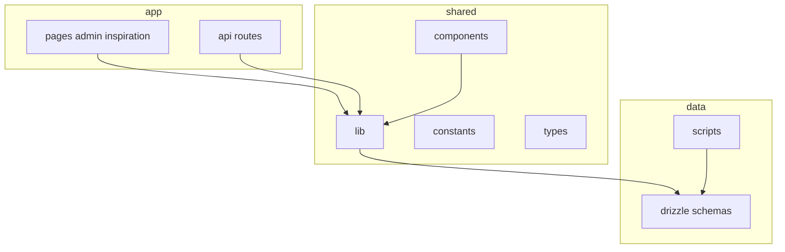

# AGENTS.md — 开发指引

面向在本仓库中协作的人类开发者与 AI Agent：说明项目目的、目录结构、数据与环境约定，以及修改代码时的注意点。

---

## 1. 项目简介

**waken-wa**（见 [package.json](package.json)）是基于 **Next.js App Router** 的个人站点：

- **访客**：首页展示个人状态、日程、动态时间线、灵感内容等；可配置整站访问锁（hCaptcha 等）。
- **管理员**：后台管理用户、设备、API Token、站点设置、灵感素材与活动等。

数据层使用 **Drizzle ORM**。运行时根据环境在 **SQLite**（本地 `file:`，默认开发）与 **PostgreSQL**（部署常见）之间切换。

### 技术栈一览

| 层级 | 说明 |
|------|------|
| 框架 | Next.js 16.x（[package.json](package.json)），`output: 'standalone'`（[next.config.mjs](next.config.mjs)） |
| UI | React 19、Tailwind 4、Radix UI、[components/ui/](components/ui/)（类 shadcn 结构） |
| 数据 | Drizzle、[better-sqlite3](package.json) / [pg](package.json)；双 schema：[drizzle/schema.sqlite.ts](drizzle/schema.sqlite.ts)、[drizzle/schema.pg.ts](drizzle/schema.pg.ts) |
| 统一表导出 | [lib/drizzle-schema.ts](lib/drizzle-schema.ts) 按 `DATABASE_URL` 是否为 Postgres URL 选择 |
| DB 入口 | [lib/db.ts](lib/db.ts)（`server-only`），开发环境会缓存连接实例 |
| 认证 | JWT（[jose](package.json)）+ Cookie；密码 [bcryptjs](package.json)；核心 [lib/auth.ts](lib/auth.ts) |
| 校验 | Zod、react-hook-form |
| 活动实时更新 | [app/api/activity/stream/route.ts](app/api/activity/stream/route.ts)：SSE，服务端定时聚合数据（非 WebSocket） |

---

## 2. 仓库地图

### 顶级目录职责

- **[app/](app/)**
  - **页面**：[app/page.tsx](app/page.tsx) 首页（站点锁、资料、日程横幅、灵感、活动流等，`dynamic = 'force-dynamic'`）；[app/admin/](app/admin/)（登录、仪表盘、[setup](app/admin/setup/page.tsx)）；[app/inspiration/](app/inspiration/) 灵感列表与详情。
  - **API**
    - 认证：[app/api/auth/](app/api/auth/)（login / logout / session）
    - 管理：[app/api/admin/](app/api/admin/)（users、settings、devices、tokens、activity、settings/export、setup/admin、change-password 等）
    - 活动：[app/api/activity/route.ts](app/api/activity/route.ts)、[app/api/activity/stream/route.ts](app/api/activity/stream/route.ts)
    - 灵感：[app/api/inspiration/](app/api/inspiration/)（entries、assets、img）
    - 站点解锁：[app/api/site/unlock/route.ts](app/api/site/unlock/route.ts)
- **[lib/](lib/)**：数据库、认证、活动聚合（含 Steam：[lib/steam.ts](lib/steam.ts)、[lib/activity-feed.ts](lib/activity-feed.ts)）、主题、站点配置读写（含 [lib/site-settings-read.ts](lib/site-settings-read.ts)、[lib/site-settings-write.ts](lib/site-settings-write.ts) 及 `site-settings-read-utils.ts`、`site-settings-record.ts`、`site-settings-write-core.ts`、`site-settings-write-theme.ts`、`site-settings-write-schedule.ts`、`site-settings-write-rules.ts`、`site-settings-write-entries.ts`），[lib/rate-limit.ts](lib/rate-limit.ts) 等。
- **[components/](components/)**：业务组件（如 [current-status.tsx](components/current-status.tsx)、[activity-feed-provider.tsx](components/activity-feed-provider.tsx)）、[components/admin/](components/admin/)、[components/ui/](components/ui/)。`components/admin/` 当前常见的拆分块包括 `dashboard-overview-panel.tsx`、`dashboard-utils.ts`、`web-settings-controller-actions.ts`、`web-settings-custom-surface-inset-panel.tsx`、`web-settings-custom-surface-style-panel.tsx`、`rule-tools-app-rules-dialogs.tsx`、`rule-tools-list-dialogs.tsx`、`schedule-manager-actions.ts`、`schedule-home-display-card.tsx`、`schedule-period-template-card.tsx`、`status-card-color-input.tsx`、`status-card-preview-result-panel.tsx`。
- **[hooks/](hooks/)**：如 [use-activity-feed.ts](hooks/use-activity-feed.ts)、[use-is-client.ts](hooks/use-is-client.ts)。
- **[constants/](constants/)**：领域常量（如 [constants/activity-api.ts](constants/activity-api.ts)、[constants/admin-dashboard.ts](constants/admin-dashboard.ts)、[constants/site-settings.ts](constants/site-settings.ts)、[constants/site-settings-storage.ts](constants/site-settings-storage.ts)、[constants/status-card.ts](constants/status-card.ts)）。
- **[types/](types/)**：领域与 API 相关 TypeScript 类型（如 [types/web-settings.ts](types/web-settings.ts)、[types/site-settings.ts](types/site-settings.ts)、[types/status-card.ts](types/status-card.ts)、[types/openapi.ts](types/openapi.ts)、[types/schedule-manager.ts](types/schedule-manager.ts)）。
- **[drizzle/](drizzle/)**：双 schema；本地开发数据库默认放在 [data/dev.db](data/dev.db)。
- **[scripts/](scripts/)**：环境解析与数据库脚本（见下文）。
- **[proxy.ts](proxy.ts)**：导出 `proxy` 与 `matcher`，对敏感路径限流、对 `/api/admin/*`（除 setup）要求 `session` Cookie。若你使用的 Next.js 版本对边界层文件名或导出约定不同，以**当前仓库能实际生效的配置**为准，并查阅对应版本官方文档。

---

## 3. 本地开发

- **依赖安装与构建**：由开发者在本地执行（例如 `pnpm install`、`pnpm dev`、`pnpm build`）；请勿假设 CI/Agent 环境已安装依赖。
- **Node / 包管理器版本**：[package.json](package.json) 未声明 `engines` 时，以团队约定或部署环境为准。

常用脚本（定义见 [package.json](package.json)）：

| 命令 | 用途 |
|------|------|
| `pnpm dev` | 开发服务器 |
| `pnpm build` / `pnpm start` | 生产构建与启动 |
| `pnpm lint` | ESLint |
| `pnpm db:push` | 按当前环境选择配置执行 `drizzle-kit push`（[scripts/drizzle-push-by-env.mjs](scripts/drizzle-push-by-env.mjs)） |
| `pnpm db:push:postgres` | 强制 PostgreSQL 配置推送 |
| `pnpm db:init` | 数据库初始化脚本 [scripts/init-db.mjs](scripts/init-db.mjs) |

`postinstall` 会运行 [scripts/init-db.mjs](scripts/init-db.mjs)，用于安装后的数据库准备（与脚本实现保持一致）。

---

## 4. 数据库与环境变量

### 选择 SQLite 还是 PostgreSQL

- **`DATABASE_URL`** 为主开关：值为 `postgres(ql)://...` 时使用 PostgreSQL（见 [lib/db-env.ts](lib/db-env.ts)、[lib/db.ts](lib/db.ts)）。
- 未配置或非 Postgres URL 时，应用侧默认使用 SQLite 文件路径（例如 [lib/db.ts](lib/db.ts) 中的 `file:./data/dev.db` 逻辑）。

### 别名与脚本

- [lib/db-env.ts](lib/db-env.ts)：`applyDatabaseUrlAliases()`、`pickPostgresUrlFromEnv()`，在 `DATABASE_URL` 缺失时从 `POSTGRES_URL` 等补齐。
- [scripts/resolve-database-env.mjs](scripts/resolve-database-env.mjs)：加载 `.env` / `.env.local`、选择 Drizzle 配置、`POSTGRES_URL_NON_POOLING` 在初始化时优先（直连）。

### 其他

- **`JWT_SECRET`**：可选；未设置时从数据库 `system_secrets` 读取或生成（[lib/auth.ts](lib/auth.ts)）。
- hCaptcha、反向代理下的公开 URL 等：见各模块注释，例如 [lib/public-request-url.ts](lib/public-request-url.ts) 中的 `PUBLIC_APP_URL`。

### 双 schema 约定

新增或变更表结构时须同时维护：

1. [drizzle/schema.pg.ts](drizzle/schema.pg.ts)
2. [drizzle/schema.sqlite.ts](drizzle/schema.sqlite.ts)
3. 在 [lib/drizzle-schema.ts](lib/drizzle-schema.ts) 中导出并在应用中使用统一符号

推送 schema 使用 `pnpm db:push` 或 `pnpm db:push:postgres`（具体 config 文件见 [drizzle.config.pg.ts](drizzle.config.pg.ts)、[drizzle.config.sqlite.ts](drizzle.config.sqlite.ts)）。

### 站点设置迁移后的新增 key 约定

站点设置已从旧的 `site_config` 实体列模式迁移到 split/v2 存储：

- **旧表**：[drizzle/schema.sqlite.ts](drizzle/schema.sqlite.ts) / [drizzle/schema.pg.ts](drizzle/schema.pg.ts) 中的 `siteConfig` 是 legacy 兼容层，主要用于未迁移环境、初始化和旧数据读取。
- **新设置 key**：迁移后应写入 `site_config_v2_entries`（以及 theme / schedule / rules 的分类表），不要为了普通新增设置继续给 `site_config` 加实体列。
- **读取默认值**：新 key 在老表或旧数据中不存在时，应用层必须给默认值（通常在 [lib/site-config-normalize.ts](lib/site-config-normalize.ts)、表单初始值、前台消费处兜底），不要依赖 legacy 列。
- **保存保护**：如果新 key 只支持迁移后的 v2 存储，应加入 [lib/site-settings-constants.ts](lib/site-settings-constants.ts) 的 `SITE_SETTINGS_MIGRATED_CORE_KEYS`（或相应分类约束），并在 [lib/site-settings-write.ts](lib/site-settings-write.ts) 中保持未迁移状态下返回“请先迁移到新方案”。
- **写入链路**：核心设置 key 通常需要同时检查 [constants/site-settings.ts](constants/site-settings.ts)、[constants/site-settings-storage.ts](constants/site-settings-storage.ts)、[lib/llm-site-config.ts](lib/llm-site-config.ts)（`prepareSiteConfigValuesFromPayload`）、[lib/site-config-normalize.ts](lib/site-config-normalize.ts)、[components/admin/use-web-settings-controller.ts](components/admin/use-web-settings-controller.ts)、[components/admin/web-settings-controller-actions.ts](components/admin/web-settings-controller-actions.ts)、[components/admin/web-settings-store.ts](components/admin/web-settings-store.ts)、[types/web-settings.ts](types/web-settings.ts)、导入导出与 OpenAPI schema，以及 [lib/site-settings-write.ts](lib/site-settings-write.ts) 的 `*-core/theme/schedule/rules/entries` 拆分。
- **何时改 schema**：只有新增真正的数据表、分类存储表、业务记录表，或必须兼容未迁移 legacy 单表写入的字段时，才改 PG/SQLite schema。若只是迁移后设置 key，不改 `site_config`。

### SQLite JSON 绑定注意事项

- **SQLite（better-sqlite3）参数绑定不接受对象/数组**：写入时只能 bind number/string/bigint/buffer/null。
- 若你在 PG 用 `jsonb(...)`、在 SQLite 用 `text(..., { mode: 'json' })`：
  - **写入 SQLite 时不要直接传 JS object**；请传 `JSON.stringify(value)`（或确保 Drizzle/driver 层会做 stringify）。
  - **读取时兼容 string/object**：在应用层统一 `typeof raw === 'string' ? JSON.parse(raw) : raw`。

### 迁移与已有数据（数据优先）

- **新增列不要加 `.notNull()`**（Agent / 协作者默认遵守）：优先**可空**列 + 可选 `.default(...)`；应用层用 `x === true`、`Boolean(x)` 等把 `null`/`undefined` 当关闭或默认，避免 `db:push` 对已有行触发 data-loss 警告或迁移摩擦。
- 仅在业务**强制**不能接受 `NULL` 时，再对新列使用 `.notNull()`，且必须同时声明服务端 `.default(...)`（PostgreSQL 若 Kit 仍不识别布尔默认，可用 `drizzle-orm` 的 `sql` 模板写字面默认值）。

---

## 5. 认证与安全要点

- **管理会话**：JWT 存 Cookie（逻辑见 [lib/auth.ts](lib/auth.ts)）；管理 API 在 [proxy.ts](proxy.ts) 层要求存在 `session` Cookie（`/api/admin/setup` 除外），路由内仍会校验 JWT。
- **站点锁**：与 `site_lock` 等 Cookie 相关，见 [lib/auth.ts](lib/auth.ts) 与首页 [app/page.tsx](app/page.tsx)。
- **限流**：[proxy.ts](proxy.ts) 对登录、站点解锁、改密等 POST 路径限流；实现依赖 [lib/rate-limit.ts](lib/rate-limit.ts)。

### 缓存策略

- 默认缓存模式采用**进程内内存优先，Redis 次级，数据库/原始源最终源**。
- 适用与例外、serverless 注意事项、以及本仓库的特殊模块说明，统一见 [docs/cache-strategy.md](docs/cache-strategy.md)。
- 新增缓存前，先判断该场景是否需要跨实例原子性；若需要，**不要**强行套用 Standard A。

---

## 6. 功能模块索引（关键文件）

| 模块 | 说明 | 入口参考 |
|------|------|----------|
| 首页与布局 | 动态元数据、全局鼠标倾斜开关 | [app/layout.tsx](app/layout.tsx)、[app/page.tsx](app/page.tsx) |
| 活动流 | REST + SSE、活动聚合 | [app/api/activity/route.ts](app/api/activity/route.ts)、[app/api/activity/stream/route.ts](app/api/activity/stream/route.ts)、[lib/activity-feed.ts](lib/activity-feed.ts) |
| 管理后台 UI | 仪表盘、设置、设备、规则工具、课表、状态卡 | [app/admin/](app/admin/)、[components/admin/](components/admin/)、[components/admin/dashboard.tsx](components/admin/dashboard.tsx)、[components/admin/web-settings-rule-tools.tsx](components/admin/web-settings-rule-tools.tsx)、[components/admin/schedule-manager.tsx](components/admin/schedule-manager.tsx)、[components/admin/status-card-preview-panel.tsx](components/admin/status-card-preview-panel.tsx) |
| 灵感 | 列表页与 API | [app/inspiration/](app/inspiration/)、[app/api/inspiration/](app/api/inspiration/) |
| 站点配置与设置 | legacy `site_config` + 迁移后 split/v2 设置存储 | [lib/site-settings-read.ts](lib/site-settings-read.ts)、[lib/site-settings-write.ts](lib/site-settings-write.ts)、[lib/site-settings-write-core.ts](lib/site-settings-write-core.ts)、[lib/site-settings-write-theme.ts](lib/site-settings-write-theme.ts)、[lib/site-settings-write-schedule.ts](lib/site-settings-write-schedule.ts)、[lib/site-settings-write-rules.ts](lib/site-settings-write-rules.ts)、[lib/site-settings-write-entries.ts](lib/site-settings-write-entries.ts)、[lib/site-config-v2.ts](lib/site-config-v2.ts) |

---

## 7. Agent / 协作者工作准则

1. **数据库变更**：必须同步 PG 与 SQLite 两套 schema，并更新 [lib/drizzle-schema.ts](lib/drizzle-schema.ts)。**新增列不要加 `.notNull()`**（默认可空 + 代码侧默认值）；确需 `NOT NULL` 时须带服务端 `.default`（见上文「迁移与已有数据」）。普通站点设置新增 key 优先走迁移后的 v2 存储，不要默认给 legacy `site_config` 加列。
2. **优先复用**：业务逻辑放在 [lib/](lib/)，页面与 Route 保持精简。
3. **服务端边界**：数据库与敏感逻辑使用 `server-only`（参见 [lib/db.ts](lib/db.ts)），避免在客户端包中引入服务端专用模块。
4. **大改前**：先阅读相关 `app/api/**/route.ts` 与 [lib/](lib/) 中的既有实现，保持命名与错误处理风格一致。
5. **避免无关重构**：单次变更聚焦需求，不扩大范围重排代码。
6. **代码注释**：使用 **英文**（与仓库惯例一致）。
7. **设计美学**：每个组件需符合设计美学，保持信息层级、留白节奏、视觉一致性与交互反馈的清晰度。
8. **Windows 命令优先级**：在 Windows 环境提供命令示例时，优先给出 **PowerShell** 版本；仅在确有必要时再补充 Bash / `curl` 风格写法。
9. **工程化习惯**：按下文第 9 节执行共享常量、共享类型、normalize、`switch`、拆分阈值与兼容性规则。

### 代码风格

- 路径别名：`@/*` 指向仓库根（[tsconfig.json](tsconfig.json)）。
- Import 排序：[eslint.config.mjs](eslint.config.mjs) 启用 `simple-import-sort`。

---

## 8. 配置文件速查

| 文件 | 用途 |
|------|------|
| [next.config.mjs](next.config.mjs) | standalone、外部包、图片、tracing |
| [tsconfig.json](tsconfig.json) | TypeScript 与路径别名 |
| [eslint.config.mjs](eslint.config.mjs) | ESLint |
| [drizzle.config.pg.ts](drizzle.config.pg.ts) / [drizzle.config.sqlite.ts](drizzle.config.sqlite.ts) | Drizzle Kit 配置 |

---

## 9. 工程化补充规则

### 9.1 Constants / Types

- 共享常量放 `constants/<domain>.ts`，共享类型放 `types/<domain>-<usage>.ts`。
- 不要新增 `constants/index.ts` 作为大杂烩。
- 新增第二个使用方后，局部常量/类型应在本次变更里迁出。

### 9.2 Normalize

- normalize 只放在边界层：API payload、legacy DB row、SQLite JSON、env/cookie/header/search params、第三方返回值、旧数据迁移。
- 不要为了内部对象传递、已有表单 state、简单默认值或新设置 key 重复 normalize。
- 优先 Zod/schema、builder/helper、单入口 parse、统一 DB 读写转换。

### 9.3 函数命名

- 新增业务函数优先 PascalCase，尤其导出的 helper、factory、controller。
- 例外：Route Handler、`useXxx` hook、局部 `handleXxx`、已有公共函数名、框架或第三方约定。
- 不要为了风格单独批量重命名已有公共函数。

### 9.4 if / switch

- 同一个变量的多分支优先 `switch`。
- `if` 仅保留 guard clause、单条件、语义完全不同的双条件、权限/异常短路、类型收窄。
- 触碰到字符串/枚举分支时，优先顺手改成 `switch`。

### 9.5 拆分阈值

- 单文件超过 500 行且本次还要继续增加逻辑、单函数超过 80 行、同一个函数同时做 parse/validate/DB/UI/response、一个组件同时处理查询/表单/弹窗/列表/导入导出、一个 `lib` 文件同时包含常量/类型/normalize/写入/缓存失效时，都应考虑拆分。
- 优先方向：`constants/<domain>.ts`、`types/<domain>-<usage>.ts`、`lib/<domain>-parse.ts`、`lib/<domain>-query.ts`、`lib/<domain>-write.ts`、`components/<domain>/<part>.tsx`、`components/<domain>/use-<feature>.ts`。
- 不要为了“工程化”硬拆没有复用价值的一层。

### 9.6 兼容性

- 需要兼容：`site_config` legacy 表、split/v2 site settings 迁移状态、SQLite JSON 历史格式、已发布 API、已有 Cookie/localStorage key、环境变量别名。
- 不需要兼容：新的后台 UI state、未发布 API、v2-only 设置 key、新组件 props、新 constants/types 结构。
- 如果保留兼容分支，要能明确说明兼容对象是什么。

### 9.7 站点设置特别规则

- 新设置先判断属于 core / theme / schedule / rules / status-card / activity/media / security。
- 普通新增设置 key 优先进入 split/v2 存储，不要默认给 `site_config` 加列。
- 修改链路通常要一起看：`constants/site-settings.ts`、`constants/site-settings-storage.ts`、`lib/site-settings-read.ts`、`lib/site-settings-write.ts`、`lib/llm-site-config.ts`、`lib/site-config-normalize.ts`、`components/admin/use-web-settings-controller.ts`、`components/admin/web-settings-controller-actions.ts`、`components/admin/web-settings-store.ts`、`types/web-settings.ts`、对应 panel/component、导入导出与 OpenAPI schema。
- 如果新 key 只支持迁移后的 v2 存储，要加迁移保护，并在 legacy 状态下返回“请先迁移到新方案”。

### 9.8 数据库修改特别规则

- DB 变更必须同步 `drizzle/schema.pg.ts`、`drizzle/schema.sqlite.ts` 和 `lib/drizzle-schema.ts`。
- 新列默认可空；只有业务强制不能为 `NULL` 时才用 `.notNull()`，并且要带服务端默认值。
- SQLite JSON 不能直接 bind object/array；写入时传 string 或确保 helper 会 stringify，读取时只在边界处兼容 string/object。

### 9.9 API 与 UI 工程化规则

- API route 保持薄层：鉴权、读 request、调用 `lib/`、返回 response。
- React 组件保持职责清楚：展示组件只收 props，状态放 hook/store，固定选项放 constants，共享类型放 types，复杂派生值放 helper。
- 后台大组件后续改动时，优先把新增功能放到新子组件或新 hook，不继续扩大原文件。

### 9.10 修改前检查清单

- 这个常量是否被多个文件使用？是否该进 `constants/<domain>.ts`？
- 这个类型是否跨文件共享？是否该进 `types/`？
- 这段 normalize 是否真的只在边界层？
- 是否为了没有历史数据的新功能写了兼容代码？
- 是否有多个同变量分支可以改成 `switch`？
- 文件结构是否仍然是 import -> constants/vars -> types -> functions？
- 新逻辑是否让单文件或单函数明显过大？
- 是否触碰数据库 schema？PG / SQLite / 统一导出是否同步？
- 是否触碰站点设置？读写链路、UI store、OpenAPI、导入导出是否同步？
- 是否至少跑过本次变更相关的 `pnpm lint` 或 `pnpm typecheck`？

