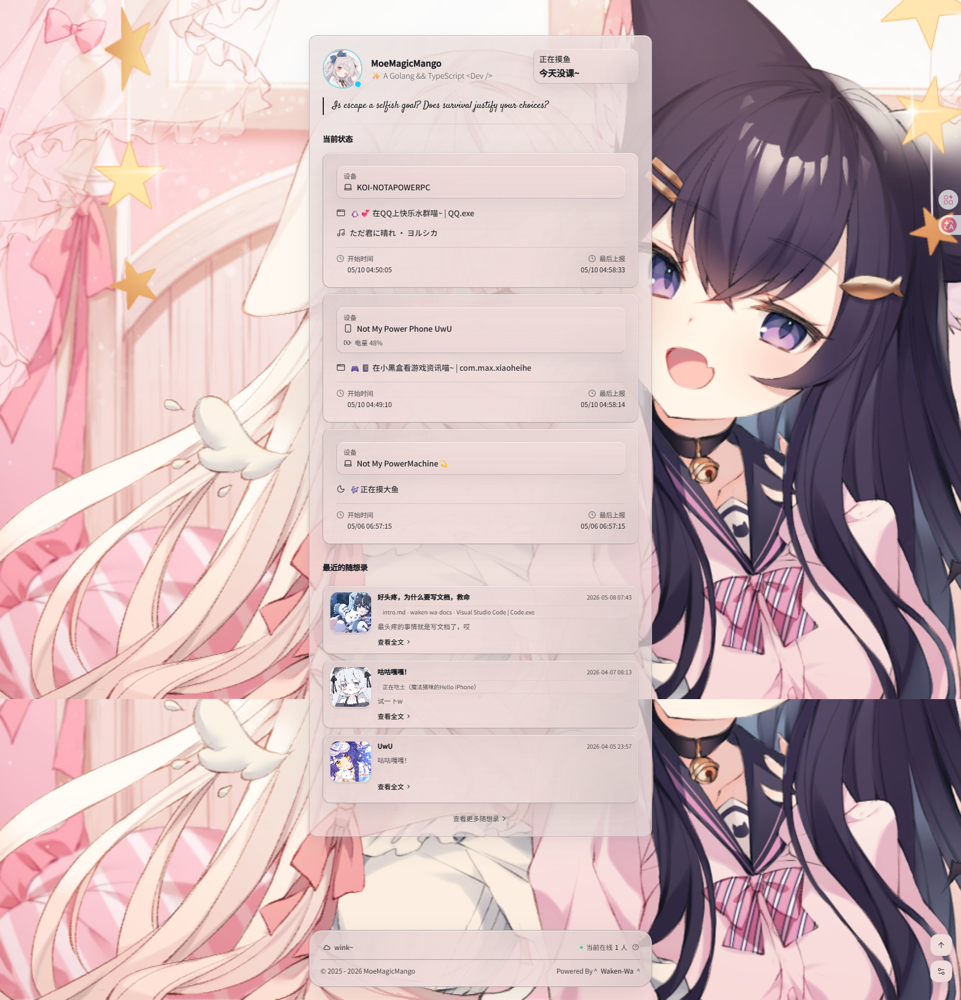
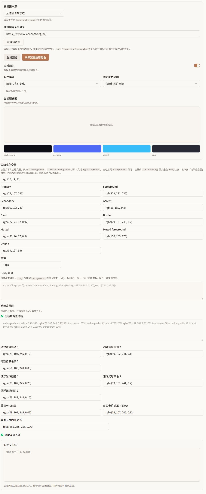
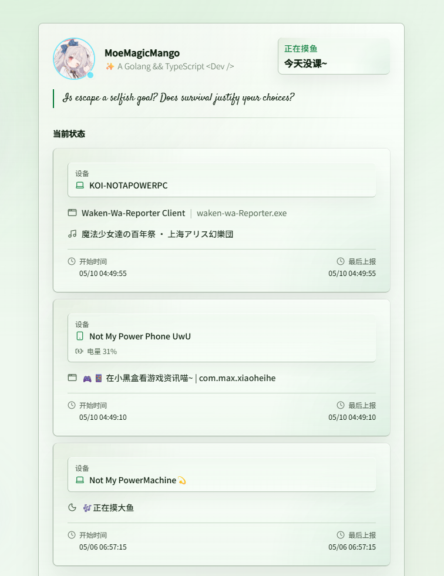
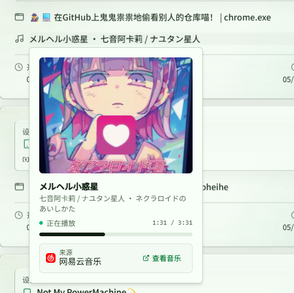

<div align="right">
  <span>[<a href="./README_EN.md">English</a>]</span>
  <span>[<a href="./README.md">简体中文</a>]</span>
</div>

> Waking up is not just opening your eyes in the morning. It is also the quiet feeling of writing "today was good" before going to sleep.

<p align="center">
  
  <h2 align="center">Waken Wa💫</h2>
  <p align="center">
    
    
    
    <a href="https://deepwiki.com/MoYoez/Waken-wa">
      
    </a>
  </p>
</p>

<p align="center">
  
</p>

✨ A self-hosted personal status dashboard.

🎗️ Turn your devices, music, apps, Steam, schedules, and thoughts into a real-time personal homepage.

> 🌟 Inspired by [Sleepy](https://github.com/sleepy-project/sleepy) and [Shiro](https://github.com/Innei/Shiro)

> ✨ Demo: [Status](https://Status-me.lemonkoi.one)

## What can it do?

### 🕵️ A self-hosted status dashboard

Turn your online presence, currently playing music, active apps, Steam games, schedules, and thoughts into a live homepage your friends can view.

### 🎨 More than a status page

<p align="center">
  
</p>

Theme colors, custom backgrounds, status display rules, and personalized cards make the site feel like your own digital space instead of a cold monitoring panel.

### 📡 Automatic multi-device sync

<p align="center">
  
</p>

Use Reporter or API uploads to sync desktop, mobile, or script-based status updates automatically.

### 🎵 Music, apps, games, and schedules

<p align="center">
  
</p>

Show not only online or offline status, but also music progress, current apps, Steam games, and ICS class or calendar schedules.

### 🧩 Embeddable and extensible


<br>

Useful as a personal homepage, BBS signature card, GitHub README status card, or a shared “peek into what I am doing” page. It can also be extended through OpenAPI and custom rules.

For more details, see: [Waken-Wa-Docs](https://waken-wa-docs.xwx.today)

## Deployment

> If you want activity reporting, use it together with [Waken-Wa-Reporter](https://github.com/MoYoez/waken-wa-reporter).

### 1. Local deployment

#### Docker with the packaged one-click script

Make sure **Docker** is installed, including `docker compose`. Then run:

```bash
curl -fsSL https://waken-wa.xwx.today | bash
```

If you want to deploy the latest `main` branch version explicitly, enable it with:

```bash
curl -fsSL https://waken-wa.xwx.today | USE_LATEST_VERSION=1 bash
```

#### Build from source

Run this from the root of a cloned repository:

```bash
chmod +x deploy-build-from-source.sh   # Needed on Unix the first time
./deploy-build-from-source.sh
# Or: bash deploy-build-from-source.sh
```

#### Deploy on Windows

##### 1. Prepare the environment

- **Docker Desktop** is recommended, or use another Docker Compose compatible container tool such as Podman Desktop.

##### 2. Get the source code

Using Git is recommended:

```powershell
git clone https://github.com/MoYoez/waken-wa.git
cd waken-wa
```

Or download the ZIP archive manually, extract it, and enter the project directory.

##### 3. Configure environment variables

- Copy `.env.example` to `.env` and adjust it as needed. In many cases, no extra configuration is required unless you want customization.

##### 4. Start the container

If you only want to run the official image, open PowerShell or CMD in the project root and run:

```powershell
docker compose up -d
```

##### 5. Build from source

If you need source changes or a custom image, run:

```powershell
docker compose up -d --build
```

---

### 2. Railway

[](https://railway.com/deploy/waken-wa)

> Railway may require a Hobby plan.

### 3. Vercel

> Vercel requires PostgreSQL (Supabase / Neon) and Redis, and the cost can be relatively high because of SSE long connections and frequent realtime POST updates.

> If you deploy on Vercel, consider using non-realtime activity uploads and enabling Polling in the admin panel.

[](
https://vercel.com/new/clone?repository-url=https://github.com/MoYoez/waken-wa
)

> After the first deployment, do not worry if you see errors. In the project's "Integrations" page, open "Marketplace", install **PostgreSQL** and **Redis**, connect them to this project, and redeploy.

> If you want to use your own provider, set the address in `DATABASE_URL`. Be mindful of serverless URL compatibility on platforms like Vercel to avoid deployment failures.

## Development

See [**DEVELOPMENT.md**](DEVELOPMENT.md).

## API reference

- Interactive Scalar docs: [`/api-reference`](./app/api-reference/route.ts)
- OpenAPI JSON: [`/api/openapi.json`](./app/api/openapi.json/route.ts)
- Device quickstart: [`docs/activity-reporting.md`](./docs/activity-reporting.md)
- Inspiration quickstart: [`docs/inspiration-integration.md`](./docs/inspiration-integration.md)

---

## Star History

<a href="https://www.star-history.com/?repos=moyoez%2Fwaken-wa&type=date&logscale=&legend=top-left">
 <picture>
   <source media="(prefers-color-scheme: dark)" srcset="https://api.star-history.com/chart?repos=moyoez/waken-wa&type=date&theme=dark&logscale&legend=top-left" />
   <source media="(prefers-color-scheme: light)" srcset="https://api.star-history.com/chart?repos=moyoez/waken-wa&type=date&logscale&legend=top-left" />
   
 </picture>
</a>

---

## License

This project is licensed under the [**GNU Affero General Public License v3.0**](LICENSE) (AGPL-3.0). See [`LICENSE`](LICENSE) in the repository root for the full text.

## Thanks

This project was promoted on [**LINUX DO**](https://linux.do/). Thanks for the support!

---
